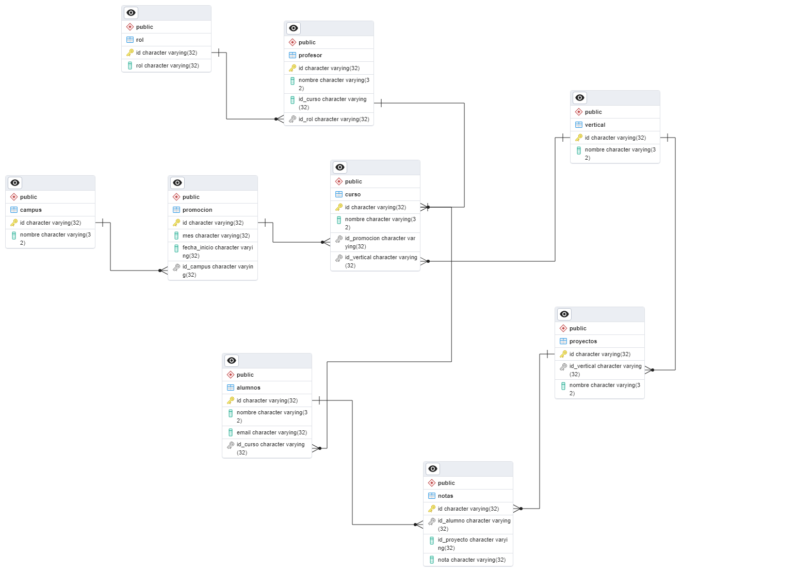

# Proyecto Normalización de BBDD

El siguiente proyecto tiene como objetivo la normalización de una base de datos ficticia de The Bridge School.

Los datos iniciales estan dentro de la carpeta [data_copy](./data_copy)

A partir de estos datos, creamos 9 tablas diferentes para eliminar redundancias y mejorar la estructura.

Luego mediante una conexión a ElephantSQL y pgAdmin4 exportaremos los datos.

[Creación de tablas](./crear_tablas.ipynb)

[Carga de datos](./agregar_datos.ipynb)

Diagrama entidad-relación:

